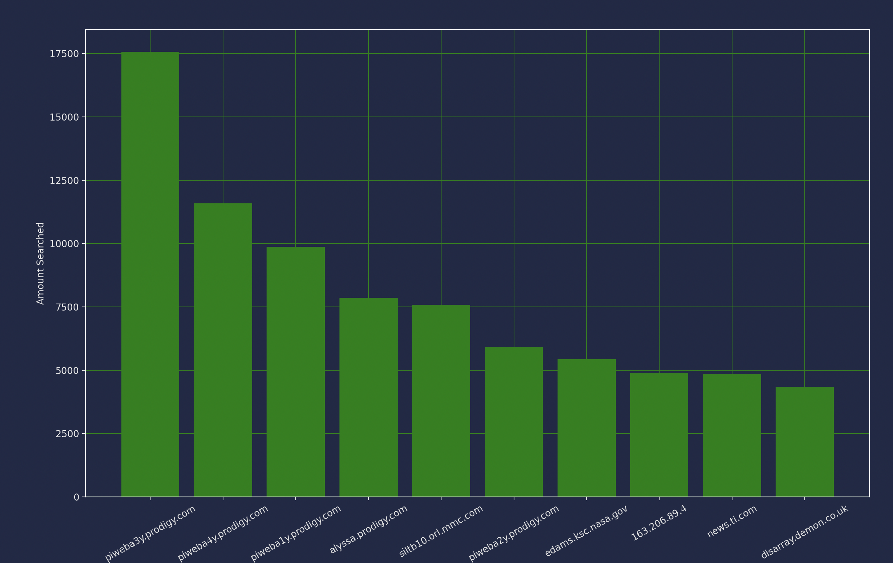
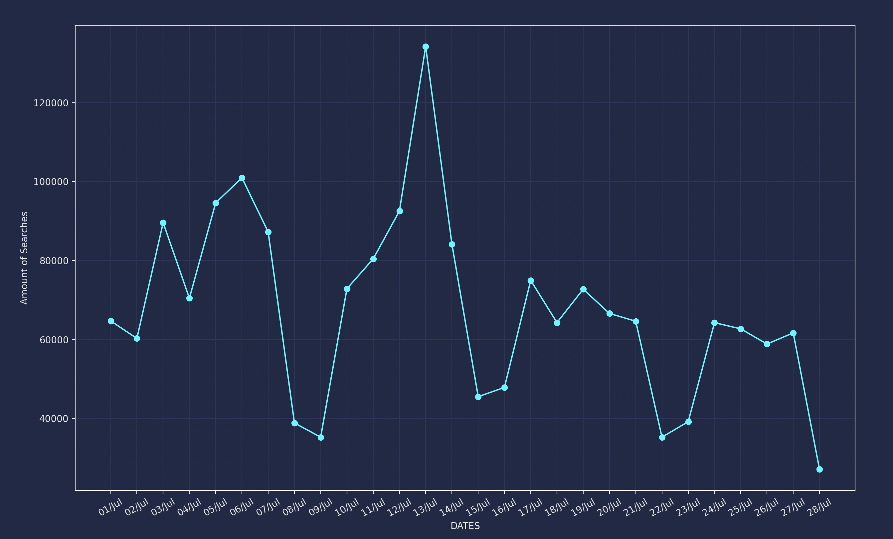

# __Introduction__
I analyzed the web server log from the year of 1995. The information that was overall anaylze the most common IP addresses and the amount of logins and browsing that occurs through certain days and show the amount that certain days show.

##  __Most Common IP Addresses__ 

The first segment that I analyzed in the graph is the IP addresses that are the most common. This would tell us the more common amount of devices or people that use the following data log. Somethings that I found during the analysis was the most common IP which was piweba3y.prodigy.com. The most amount of searches was 17572 searches in total of the following data log. In addition, prodigy.com was the most common source of IP addresses, with it dominating the top ten field. This information would allow us to identify the sources that have used the datalog the most and use this data to see what type of information that they would often use or log in the log.

##  __Most Common Dates__ 

The second segment that I have analyze was the dates and the amount that it had the most searches through out the month of July in 1995 which was the month that was the most common due to it being near the launch of the shuttle. The data that was collected and some conclusions that was made from the analysis was July 14 which was when the commet made impact on Jupiter. The amount of searches was decresed and stagnate after the following spike that had occured in the graph.

## __Suggestions__

The final conclusion that I made after my analysis to increase the traffic flow to the following site was to keep track of more events that had taken place, with it showing that it was mainly affected by the occurences that occuered. Another observation that I have made was the amount of people that had in time. There's not much addittions that could be made other then the common IPs being prodigy.com which would increase if there were more catered to.

